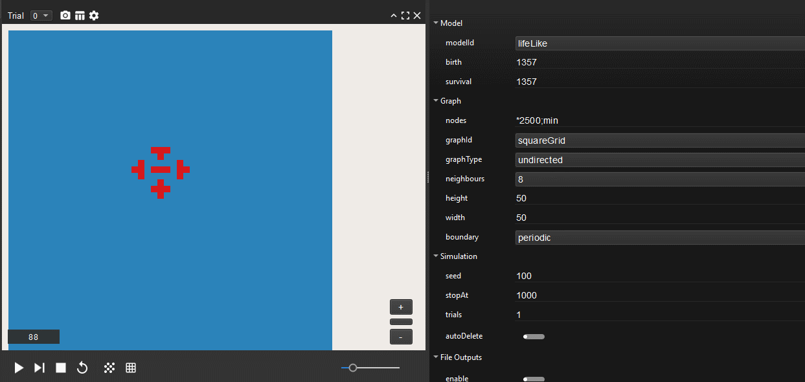

# Life-like Automata

## What is it?

This is a model plugin for [Evoplex](https://evoplex.org).

It lets you define any [life-like cellular automaton](https://en.wikipedia.org/wiki/Life-like_cellular_automaton).

## Rules Notation

The model accepts two parameters: ``birth`` and ``survival``. They indicate the number of neighbours needed for a dead cell to become alive and an active one to survive respectively.

For example, let's take the most popular example: Conway's Game of Life which is defined by the rule ``B3/S23`` so this translates to ``birth:3`` and ``survival:23``.

This means that every dead cell can become active in the next generation if and only if it has exactly 3 live neigbors.

Likewise, an active cell will survive if it has either 2 or 3 live neighbors and will die otherwise.

If you want to set a specific value to empty, simply set the respective parameter to ``-1``. For example, the correct configuration for ``B123/S`` is ``birth:123``, ``survival:-1``.

## Examples

The figure below shows an experiment implementing the Replicator plugin.

<p align="center">

</p>

## How to cite
If you mention this model or the Evoplex software in a publication, please cite it as:

> Cardinot, M., O’Riordan, C., Griffith, J., & Perc, M. (2019). Evoplex: A platform for agent-based modeling on networks. SoftwareX, 9, 199-204. https://doi.org/10.1016/j.softx.2019.02.009

```
@article{Evoplex,
author = "Marcos Cardinot and Colm O’Riordan and Josephine Griffith and Matjaž Perc",
title = "Evoplex: A platform for agent-based modeling on networks",
journal = "SoftwareX",
volume = "9",
pages = "199 - 204",
year = "2019",
issn = "2352-7110",
doi = "10.1016/j.softx.2019.02.009",
url = "http://www.sciencedirect.com/science/article/pii/S2352711018302437"
}
```

## License
This plugin is licensed under the [MIT License](https://opensource.org/licenses/MIT) terms.
